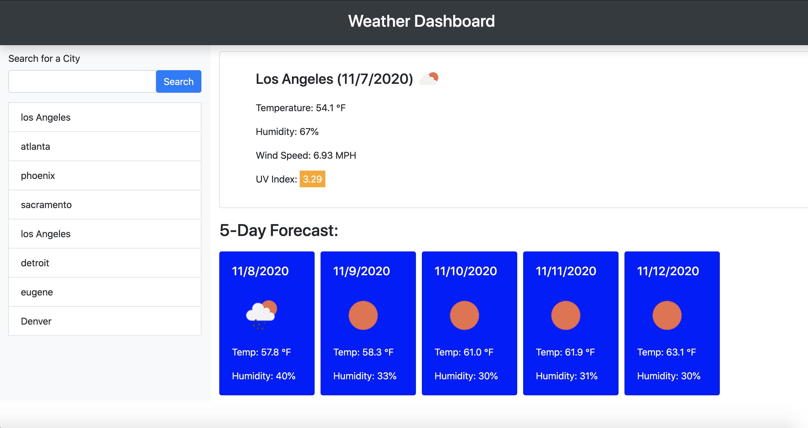

# Weather Dashboard

## The Application

I've build a weather dashboard that will run in the browser and feature dynamically updated HTML and CSS.  The dashboard allows the user to search for a city and return the weather data from that city. 

I used [OpenWeather API](https://openweathermap.org/api) to retrieve weather data for cities.

## Screenshot

## Features

When a city is searched on the dashboard, the following information is displayed: 
* Current weather conditions for that city is displayed with
    * City name
    * Current date
    * An icon representation of weather conditions
    * Temperature in Fahrenheit
    * Humidity in %
    * Wind speed in MPH
    * UV index with the following indicators:
        * UV index less than or equal to 3 -> favorable (green)
        * UV index less than or equal to 7 -> moderate (orange)
        * UV index greater than 7 -> severe (red)

* 5 day forecast of the city weather with the following information: 
    * Forecast date
    * An icon representation of weather conditions
    * Temperature in Fahrenheit
    * Humidity in %

* Stores the search term in a search grid with a maximum of 8 cities 
    * User can also click on these past names to get the city weather dashboard

## Learnings 

1. Need to use delegations for on("click") function in dyanmically building DOM elements 
2. Using fetch to call functions to ensure asynchronous functions

## Link to finished product website
[Link to finished product](https://alzcheng.github.io/weatherDashboard/)
